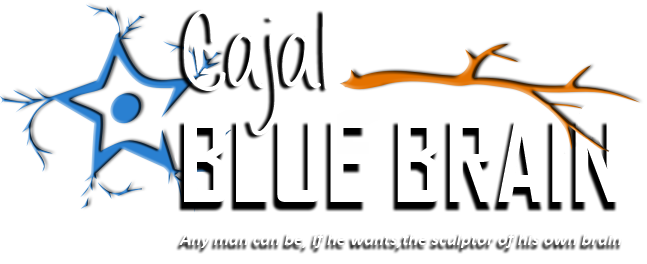

### Acknowledgements

   - HBP project
   - Cajal Blue Brain project

    This work has been partially supported by the Spanish Ministry of Economy, Industry and Competitiveness through the Cajal Blue Brain (C080020-09; the Spanish partner of the Blue Brain initiative from EPFL) and TIN2016-79684-P projects, and by the Regional Government of Madrid through the S2013/ICE-2845-CASI-CAM-CM project. This project has received funding from the European Union`s Horizon 2020 Research and Innovation Programme under Grant Agreement No. 720270 (HBP SGA1)

