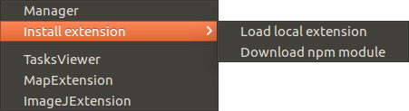
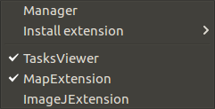

### Extensions

MultiMap is a modular tool which can be expanded through diferent extensions. It uses [electrongui](https://github.com/gherardovarando/electrongui) framework to develop them.

Extensions already present:

- [mapextension](http://github.com/gherardovarando/mapextension): creating and viewing Maps.

- [imagejextension](http://github.com/gherardovarando/imagejextension): processing images and extraction of parameters and objects.

- [GraphicsMagickExtension](https://github.com/gherardovarando/GraphicsMagickExtension): collection of tools and libraries which support reading, writing, and manipulating an image.

- [BioFormatsExtension](https://github.com/gherardovarando/bioformatsextension)

To install extensions there are two ways:

   

- Loading locally from an existent .js file. A dialog will be opened to select it.

- Downloading from npm if it is published in npm.

    

When an extension is loaded it will appear in the tab "Extensions". It is possible to activate and deactivate  clicking over the name (a check symbol will be shown at the left of the extensions that are activated).

  
