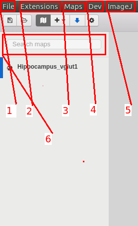

### Main menu

We have the following headers: 

- 1 File: working with the workspace. **New Workspace**, **Open Workspace**, **Save Workspace**, **Save Workspace as**, **Exit**. 
- 2 Extensions, this tab opens the **Manager** to working with the extensions, allows you to install new extensions (locally or via npm) and activate/deactivate already installed extensions.
- 3 MapExtension: this is the complete [Mapextension](https://github.com/gherardovarando/mapextension). The options are **Show**, **Show Configuration**, **Reload Map**, **Load Map**, **Create Map**, **Export Map**, **Add Layer**, **Settings**.
- 4 Developer tools: it launches an external window that shows the internal elements of the program and a console to execute commands.
- 5 ImageJExtension: executes [ImageJExtension](https://github.com/gherardovarando/imagejextension) The options are **Launch ImajeJ**, **Configure ImageJ**, **Create TileLayer**, **Object Detection**, **Holes Detection**, **Tools**.
- 6 Search bar, to find maps loaded at the moment.
