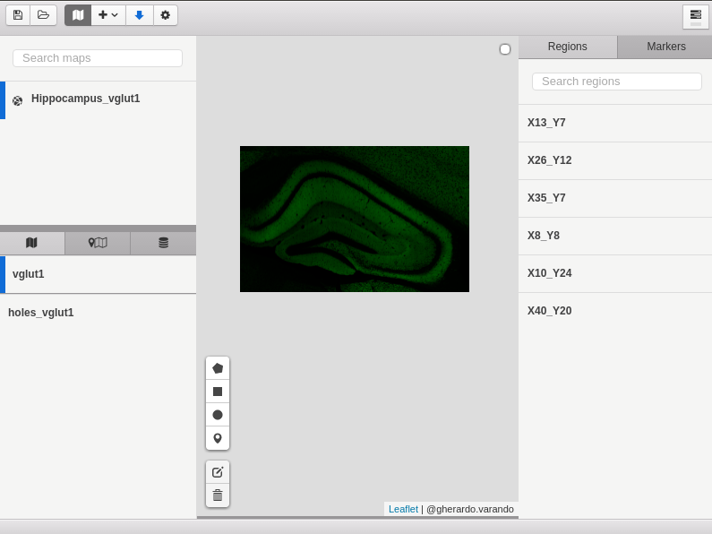
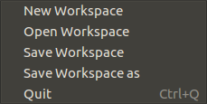
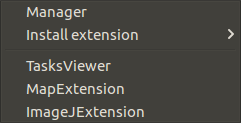
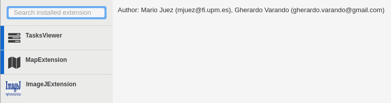
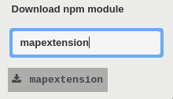

### Main menu

A complete view of the main window without any extension is shown here:

We have the following headers in the basic version of the program: 

- File: working with the workspace. 

**New Workspace**: When clicked, automatically creates a new workspace by default.

**Open Workspace**: open existent workspace with all of their settings.

**Save Workspace**: Save the current workspace.

**Save Workspace as**: Save the current workspace with another name.

**Quit**: exit of the program, it works too using Ctrl + Q. 

- Extensions: this tab opens some new options:

**Manager** 

To working with the extensions, it allows you to see which extensions are installed and activate or deactivate them from this window too.

**Install extension** 

	- Load local extension: If we have the .js file, we can open and use it.

	- Download npm module, if it is published in node package manager. Click in the tab and select the option. At the moment a window will be opened and you can search for extensions. If the extension exists in npm, click over it to install.

If any extension is installed it is possible to activate/deactivate already installed extensions.

