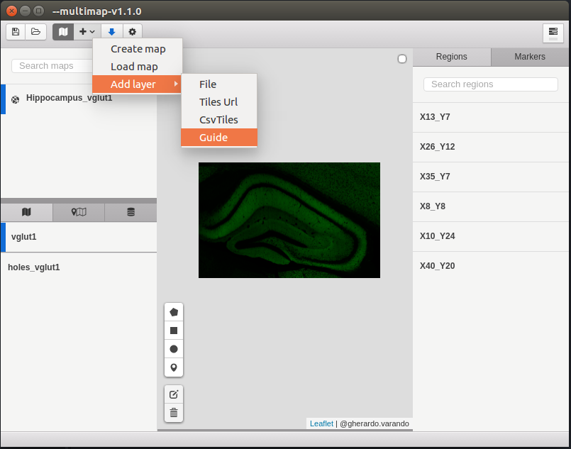
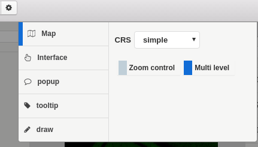
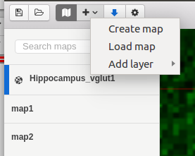
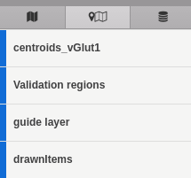
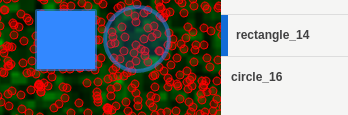
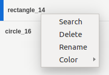
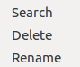

# MapExtension

Multimap allows you to load a configuration JSON file (new Leaflet map) that includes different layers of the image of the brain to be analyzed. The MapExtension extension allows you to create new maps, open an existing map, add new layers, download, and configuration options.

- 1 Map list.
- 2 Layers control.
- 3 Map main window.
- 4 Draw tools.
- 5 Region and markers list.

Within the configuration options it is possible to configure the following:

Clicking the + button on the menu at right of the map icon, we can create new maps, load existent maps, and add new layer to the map from file, url, CsvTiles object or guide. Each map can be deleted and exported to Json file.

Once a map has been loaded it is possible to navigate through all its layers making them visible or invisible as necessary. In the following example we have 4 layers, but it is possible having more depending the kind of maps we are using.

It is possible to draw diferent kinds of geometric figures and put markers on the image.

It is also possible to select or deselect the elements and regions as necessary by clicking on their name in the list.

Clicking in the right buttton is possible to search by name, delete, rename or change the colour of the selected item.

In the side of the layers it is possible too, clicking right button, and appears the same options excepting the colour.

