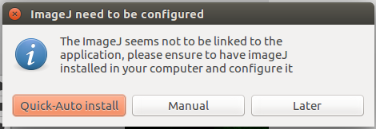
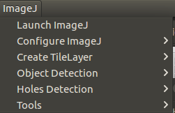

# MultiMap user guide
## v1.0.0


### Authors
 - Gherardo Varando <gherardo.varando@gmail.com>


### Overview

Multimap is a tool designed in the CIG of the UPM for the viewing and processing of brain images whose function is the extraction of statistical data from them.

### Install


#### version

 - Windows:  [multimap.Setup.exe](https://github.com/ComputationalIntelligenceGroup/MultiMap/releases/download/v1.1.0/multimap.Setup.1.1.0.exe)
 - LINUX (DEB): [multimap.deb](https://github.com/ComputationalIntelligenceGroup/MultiMap/releases/download/v1.1.0/multimap_1.1.0_amd64.deb)


#### Requeriments

- [Nodejs](https://nodejs.org/en/download/) 8.9 or later.

	- Windows: Download and Install .msi file.
 	- [LINUX:](https://nodejs.org/en/download/package-manager/)


- The latest version of [Java](http://www.oracle.com/technetwork/java/javase/downloads/jre8-downloads-2133155.html) for ImageJExtension.

 	- Windows: Download and Install .exe file.
 	- LINUX: ```sudo apt install default-jre```


### Main menu

We have the following headers: 


- 1 File: working with the workspace. **New Workspace**, **Open Workspace**, **Save Workspace**, **Save Workspace as**, **Exit**. 
- 2 Extensions, this tab opens the **Manager** to working with the extensions, allows you to install new extensions (locally or via npm) and activate/deactivate already installed extensions.
- 3 MapExtension: this is the complete [Mapextension](https://github.com/gherardovarando/mapextension) **Show**, **Show Configuration**, **Reload Map**, **Load Map**, **Create Map**, **Export Map**, **Add Layer**, **Settings**.
- 4 Developer tools: it launches an external window that shows the internal elements of the program and a console to execute commands.
- 5 ImageJExtension: executes [ImageJExtension](https://github.com/gherardovarando/imagejextension) **Launch ImajeJ**, **Configure ImageJ**, **Create TileLayer**, **Object Detection**, **Holes Detection**, **Tools**.
- 6 Search bar, to find maps loaded at the moment.

### Extensions

MultiMap is a modular tool which can be expanded through diferent extensions. It uses [electrongui](https://github.com/gherardovarando/electrongui) framework to develop them.


Extensions already present

- [mapextension](http://github.com/gherardovarando/mapextension)

- [imagejextension](http://github.com/gherardovarando/imagejextension)

- [GraphicsMagickExtension](https://github.com/gherardovarando/GraphicsMagickExtension)

- [BioFormatsExtension](https://github.com/gherardovarando/bioformatsextension)


#### Installing extensions

In the latest version of the application, the first time the application is launched, the published extensions will be installed automatically and nothing else will have to be installed.

There are two ways to install extensions:

- Loading the extension locally. For this you have to load the .js file that contains the extension. **Extensions > Install extension > Load local extension**.

- Downloading the npm module if it is published on npm. **Extensions > Install extension > Download npm module**.


#### MapExtension

Multimap allows you to load a configuration JSON file (new Leaflet map) that includes different layers of the image of the brain to be analyzed. The MapExtension extension allows you to create new maps, open an existing map, add new layers, download, and configuration options.


- 1 Map list.
- 2 Layers control.
- 3 Map main window.
- 4 Draw tools.
- 5 Region and markers list.


Within the configuration options it is possible to configure the following:


Clicking the + button on the menu at right of the map icon, we can create new maps, load existent maps, and add new layer to the map from file, url, CsvTiles object or guide. Each map can be deleted and exported to Json file.


Once a map has been loaded it is possible to navigate through all its layers making them visible or invisible as necessary. In the following example we have 4 layers, but it is possible having more depending the kind of maps we are using.


It is possible to draw diferent kinds of geometric figures and put markers on the image.


It is also possible to select or deselect the elements and regions as necessary by clicking on their name in the list.


Clicking in the right buttton is possible to search by name, delete, rename or change the colour of the selected item.


In the side of the layers it is possible too, clicking right button, and appears the same options excepting the colour.


#### ImageJExtension
[ImageJ](https://imagej.nih.gov/ij/index.html) is a public domain, Java-based image processing program developed at the National Institutes of Health. It was designed with an open architecture that provides extensibility via Java plugins and recordable macros. Analysis and processing plugins can be developed using ImageJ's built-in editor and a Java compiler. User-written plugins make it possible to solve many image processing and analysis problems.

ImageJExtension is an extension of the original Java tool that allows you to analyze, process images and work in different formats. It also allows to perform different calculations on image pixels, histogram creation, edge detection, filtering and other processing tasks. [It is necessary to have the original tool installed](https://imagej.nih.gov/ij/download.html).


#### Install

In order to use this extension it is necessary to configure ImageJ. It is possible to do it in several ways. The latest version of Multimap automatically detects if the extension has been installed and allows you to install all the necessary packages quickly. The following window will appear:



In this way everything will be installed automatically, although it is possible to perform a manual installation selecting the path in **ImageJ > Configure imageJ > Settings** and install it this way: **ImageJ > Configure imageJ > Install ImageJ**. For an optimal behaviour is needed to install all plugins: **ImageJ > Configure imageJ > Download needed plugins**.


ImageJextension adds a submenu to the application menu called "ImageJ". Six main tasks can be done:



**1. Launch ImageJ**

ImageJ user interface can be launched through "Launch ImageJ" menu entry. This tool can be useful for performing some preprocessing operations to prepare images for Atlas usage.

**2. Configure ImageJ**

ImageJ JVM memory settings (heap and stack) can be configured. By default, Java heap memory is set to 70% of total system memory, and Java stack memory is set to 515MB.

**3. Create Tile layer**

Map Tools is a toolbox for creating Atlas maps. This toolbox is an ImageJ plugin that requires an image or folder with images and the following parameters as input:

    Map name (default: "map").
    Pixel tiles dimension (default: 256).
    Maximum zoom (default: 5).
    Use all slice (default: no): if source image has more than one slice and this option is checked, a map for every slice will be created.
    Merge all slices (default: no): if source image has more than one slice and this option is checked, a max intensity projection (ImageJ ZProjection) of all slices will be performed and the output will be used as input for map creation.
    Slice used (default: 1): if source image has more than one slice, this option allows to choose what slice will be used as input for map creation.
    Output folder: the path where output map will be saved.

With this toolbox, creating layers is also possible. The difference between a map and a layer is that a map contains a JSON configuration file with information about author, map name, and the different layers that make up the map. A map created with this tool will have only one layer. Adding new layers must be done modifying configuration file manually.
**3.1. From image**

When using this option, a dialog will be opened to choose source image, then previously defined parameters can be configured. When this task finishes, the map can be added to the workspace, or the layer can be added to a map in the workspace.
**3.2. From folder**

This option is intended to create a map (or layer) from a big image which is splitted in a small collection of images. Each image name must contain its X and Y coordinates in the big image. For example, partial_image_X0_Y0.tiff will be the image in the left upper corner.

When using this option, a dialog will be opened to choose the left upper corner image, then Atlas needs to combine all images and the user will be asked to configure previously defined parameters and three additional image combination parameters:

    Initial slice (default: 1).
    Last slice (default: 1).
    Scale (default: 1.000): the combined image scale, this parameter goes from 0 to 1 (original size).

When this task finishes, the map can be added to the workspace, or the layer can be added to a map in the workspace.
**4. Object Detection**

Object detection is a tool for detecting objects in an image. For this purpose, obj_detection ImageJ plugin is used, which calculates object centroids using image segmentation techniques. This extension allows to detect objects from a single image, from a folder with many images, or from a list of images, In all cases, following parameters can be configured:

    Minimum radius (default: 1): MaxLoGs Min R parameter.
    Maximum radius (default: 5): MaxLoGs Max R parameter.
    By (default: 1): MaxLoGs step parameter.
    Threshold method (default: "Moments").
    Minimum (default: 1).
    Maximum (default: -1).
    Fraction (default: 0.500).
    Tolerance (default: 0).
    Output folder: the path where detected objects data will be saved, usually the folder with the map of the image being processed is used.

When this task finishes, the layer with detected objects data (called points layer) can be added to a map in the workspace.
**5. Holes Detection**

Holes detection is a tool for detecting holes in an image. For this purpose, obj_detection ImageJ plugin is used, which calculates holes using median filtering and thresholding. This extension allows to detect holes from a single image, from a folder with many images, or from a list of images, In all cases, following parameters can be configured:

    Radius of median filter (default: 10).
    Threshold (default: 250).
    Output folder: the path where detected holes data will be saved, usually the folder with the map of the image being processed is used.

When this task finishes, the layer with detected holes data (called pixels layer) can be added to a map in the workspace.
**6. Mosaic creation**

This tool is located inside "Tools" submenu, it allows to divide a big image into small parts (tiles). The following parameters must be configured:

    Tile size (default: 10): Defines the width and height of the output tiles.
    Original image height (default: 10).
    Original image width (default: 10).
    X0 (default: 0): The start number for generated tiles in X axis.
    Y0 (default: 0): The start number for generated tiles in Y axis.
    Output folder: the path where splitted parts (tiles) will be saved.

Each tile name will be the original image name plus its X and Y position, e.g. original_image_X0_Y0.tif usually will be the upper left corner tile.


