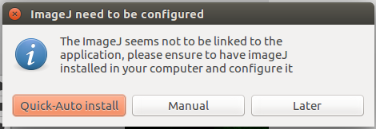
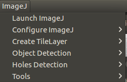
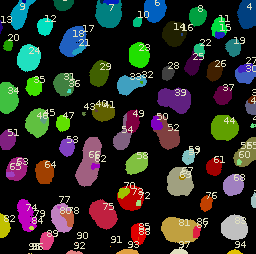
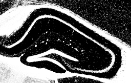
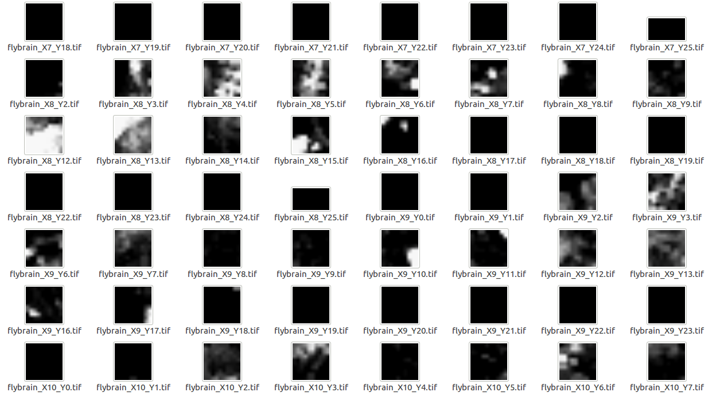

### ImageJExtension

[ImageJ](https://imagej.nih.gov/ij/index.html) is a public domain, Java-based image processing program developed at the National Institutes of Health. It was designed with an open architecture that provides extensibility via Java plugins and recordable macros. Analysis and processing plugins can be developed using ImageJ's built-in editor and a Java compiler. User-written plugins make it possible to solve many image processing and analysis problems.

ImageJExtension is a MultiMap extension that connects MultiMap to an ImageJ installation, allowing some image processing tasks directly from MultiMap.

#### Install

When the extension is activated it automatically check if it is linked to an ImageJ installation, if not the user will be warned and three options to link ImageJ will be given:
1. **Quick Auto-Install** (recommended if you don't know what we are talking about), this options automatically download ImageJ and some needed plugins.
2. **Manual** the user can manually select the path to the ImageJ installation.
3. **Later** the user can dismiss the alert and from the ImageJ menu, select the configure ImageJ sub-menu and then install ImageJ, the user will be asked to select a destination folder where ImageJ will be installed.

If options 2 or 3 are used it is suggested to install the needed plugins with the appropriate action in the configure ImageJ menu.

#### Using the extension

Some ImageJ task have problems with files names or folder names with spaces. In order to avoid errors using ImageJExtension is better to use folder and filenames without spaces.

##### Launch ImageJ

ImageJ user interface can be launched through "Launch ImageJ" menu entry. This tool can be useful for performing some preprocessing operations to prepare images for MultiMap usage.

##### Configure

ImageJ JVM memory settings (heap and stack) can be configured. By default, Java heap memory is set to 70% of total system memory, and Java stack memory is set to 515MB.

##### Create Tile Layer

Map Tools is a toolbox for creating MultiMap maps. This toolbox is an ImageJ plugin that requires an image or folder with images and the following parameters as input:

    Map name (default: "map").
    Pixel tiles dimension (default: 256).
    Maximum zoom (default: 5).
    Use all slice (default: no): if source image has more than one slice and this option is checked, a map for every slice will be created.
    Merge all slices (default: no): if source image has more than one slice and this option is checked, a max intensity projection (ImageJ ZProjection) of all slices will be performed and the output will be used as input for map creation.
    Slice used (default: 1): if source image has more than one slice, this option allows to choose what slice will be used as input for map creation.
    Output folder: the path where output map will be saved.

With this toolbox, creating layers is also possible. The difference between a map and a layer is that a map contains a JSON configuration file with information about author, map name, and the different layers that make up the map. A map created with this tool will have only one layer. Adding new layers must be done modifying configuration file manually.

###### From image

When using this option, a dialog will be opened to choose source image, then previously defined parameters can be configured. When this task finishes, the map can be added to the workspace, or the layer can be added to a map in the workspace.

###### From folder

This option is intended to create a map (or layer) from a big image which is splitted in a small collection of images. Each image name must contain its X and Y coordinates in the big image. For example, partial_image_X0_Y0.tiff will be the image in the left upper corner.

When using this option, a dialog will be opened to choose the left upper corner image, then MultiMap needs to combine all images and the user will be asked to configure previously defined parameters and three additional image combination parameters:

    Initial slice (default: 1).
    Last slice (default: 1).
    Scale (default: 1.000): the combined image scale, this parameter goes from 0 to 1 (original size).

When this task finishes, the map can be added to the workspace, or the layer can be added to a map in the workspace.

##### Object Detection

Object detection is a tool for detecting objects in an image. For this purpose, obj_detection ImageJ plugin is used, which calculates object centroids using image segmentation techniques. This extension allows to detect objects from a single image, from a folder with many images, or from a list of images, In all cases, following parameters can be configured:

    Minimum radius (default: 1): MaxLoGs Min R parameter.
    Maximum radius (default: 5): MaxLoGs Max R parameter.
    By (default: 1): MaxLoGs step parameter.
    Threshold method (default: "Moments").
    Minimum (default: 1).
    Maximum (default: -1).
    Fraction (default: 0.500).
    Tolerance (default: 0).
    Output folder: the path where detected objects data will be saved, usually the folder with the map of the image being processed is used.

When this task finishes, the layer with detected objects data (called points layer) can be added to a map in the workspace.

When image has some objects to detect, they will be shown this way:

##### Holes Detection

Holes detection is a tool for detecting holes in an image. For this purpose, obj_detection ImageJ plugin is used, which calculates holes using median filtering and thresholding. This extension allows to detect holes from a single image, from a folder with many images, or from a list of images, In all cases, following parameters can be configured:

    Radius of median filter (default: 10).
    Threshold (default: 250).
    Output folder: the path where detected holes data will be saved, usually the folder with the map of the image being processed is used.

When this task finishes, the layer with detected holes data (called pixels layer) can be added to a map in the workspace.

An example of holes detection is shown here:

##### Mosaic

This tool is located inside "Tools" submenu, it allows to divide a big image into small parts (tiles). The following parameters must be configured:

    Tile size (default: 10): Defines the width and height of the output tiles.
    Original image height (default: 10).
    Original image width (default: 10).
    X0 (default: 0): The start number for generated tiles in X axis.
    Y0 (default: 0): The start number for generated tiles in Y axis.
    Output folder: the path where splitted parts (tiles) will be saved.

Each tile name will be the original image name plus its X and Y position, e.g. original_image_X0_Y0.tif usually will be the upper left corner tile.

The result of creating a mosaic with an image is shown in the following image:

#### Issues
