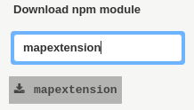

### Extensions

MultiMap is a modular tool which can be expanded through different extensions.
MultiMap is built on top of [electrongui](https://github.com/gherardovarando/electrongui) so every electrongui extension will work.

When the application starts for the first time it will install automatically the following extensions:

- [mapextension](http://github.com/gherardovarando/mapextension): creating and viewing Maps.

- [imagejextension](http://github.com/gherardovarando/imagejextension): processing images and extraction of parameters and objects.

- [devexte](https://github.com/gherardovarando/DevExt): permit developer access.

#### Installing extensions

MultiMap provides two ways of installing a new extension, both of them accessible from `Extensions > Install extension` menu.

  - `Load local extension`. For this you have to load the .js file (or the associated package.json) that contains the extension. This option is provided mainly for developers who wants to test their new extension, refer to [electrongui](https://github.com/gherardovarando/electrongui) api doc for further details.

  - `Download npm module`. The user will be promt to a search form, the npm registry can be searched and found extensions can be installed and loaded.

  

**Attention** the installed or loaded extension will not appear automatically they have to be **activated** from the `Extensions` menu.

#### Activate extensions

MultiMap extensions once loaded can be active or deactive, to use them as you can image it they have to be activated :smirk:.

Every loaded extension appear in the `Extensions` menu, a check :ballot_box_with_check: will appear next to it if the extension is active.

To toggle the active/deactive state of an extension just click on its name in the `Extensions` menu.

#### Installed and active extension registry

MultiMap keeps two registries on disk with the installed extensions and the active ones, so that every times you open the application it will look exactly how you left it (good uh?:open_mouth:).

Sometimes however, the system will not work perfectly and on opening the application you will find that some extensions you had previously installed are missing. No panic:grimacing: just try to activate the missing extension or in the worst scenario reinstall it, hopefully the workspace data will be retrieved.

#### Updating extensions

To update an extension just reinstall it, a fresh installation is always forced thus you can be sure to install always the last version.
