### MapExtension

The MapExtension is the fundamental extension of MultiMap, it permits to load a configuration file (in [map.json](https://github.com/gherardovarando/map.schema.json) format), create, export and mainly visualize maps.

#### Description
The main pane of the MapExtension is as follows:
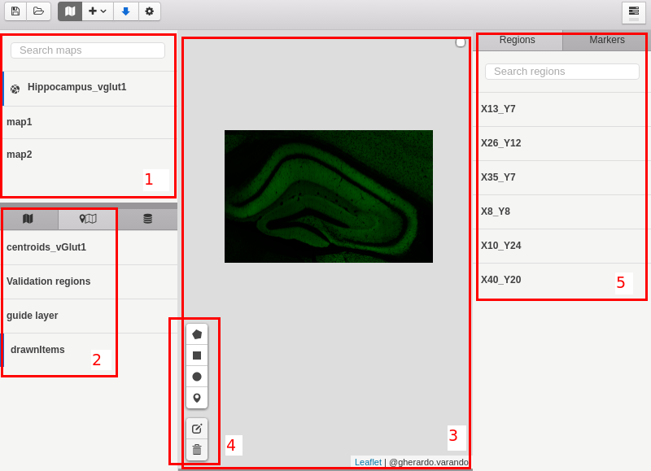

Where we can recognize the following elements:
1. **Map list**, here the map present in the loaded workspace are shown, we can select them and from the contextual menu (right-click) it is possible to remove a map from the workspace or export it to map.json format.
2. **Layers control**, the layers control permits to select/deselect layers to be shown on the map, moreover it is possible to edit some properties of the layers (check the contextual menu with the right click).
3. **Map main window** this is the visualization of the map with the selected layers.
4. **Draw tools** can be used to draw different shapes and markers.
5. **Region and markers list** here are listed all the regions and the markers in the map, from the contextual menu is possible to rename the elements, change the color, edit some details and remove them from the map.

Within the configuration options it is possible to configure the following:

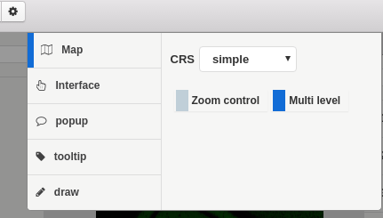

Clicking the + button on the menu at right of the map icon, we can create new maps, load existent maps, and add new layer to the map from file, url, CsvTiles object or guide. Each map can be deleted and exported to Json file.

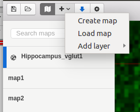

To create new maps click on "Create map". Map must be named. At the moment the new map is included int the map list, and it is added to the configuration file, and it will be loaded if we open the file in the future.

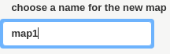 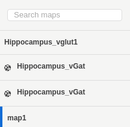

If we have previous configuration file we are able to load it clicking int the "Load map" button. A dialog window will be opened to select the file.

Add new layers to a existen map is very easy clicking "Add layer" button. There are 4 ways to do that:

- File: If we have the file locally.

- Tiles URL: searching on the Internet. Maybe is possible load the layer from remote url. Also, there are many example maps to use.

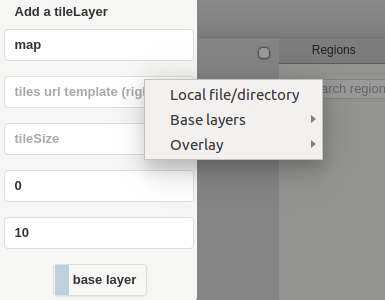

- [CsvTiles](https://github.com/gherardovarando/leaflet-csvtiles): From csv file that contains coordinates and other info about the layer.

- Grid: Custom layer. We can set some settings manually.

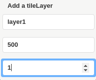

To export a map to JSON file right click on "Export map" over the desired map to export. A dialog window will be opened to save the map.

 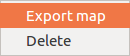

 To delete the the selected map, click on "Delete".

Also a map configuration and layer configuration can be loaded with drag and drop. Just drag to the maps region or the configuration region.

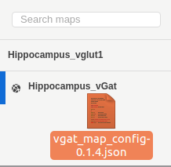

Once a map has been loaded it is possible to navigate through all its layers making them visible or invisible as necessary. In the following example we have 4 layers, but it is possible having more depending the kind of maps we are using.

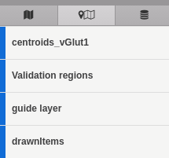          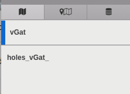

MultiMap allows to edit settings of the layers. Right button and click on "Edit". At the moment a control bar appears and we can control the contrast and the transparency of the layer.

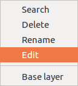

Minimum

Maximum

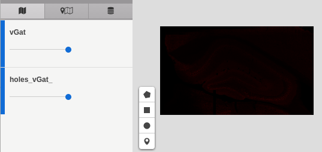

Also is possible to configure the opacity and borders of polygons drawn.

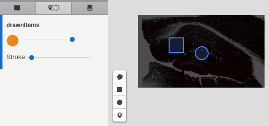

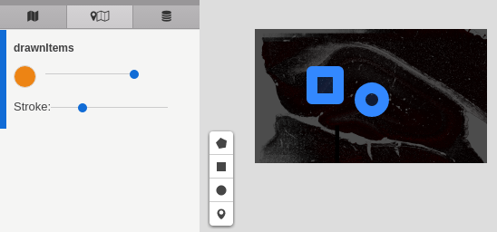

Clicking on the coloured circle it is possible to set the color of the figure.

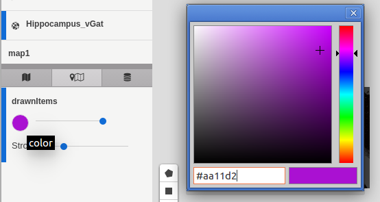

It is possible to draw diferent kinds of geometric figures and put markers on the image.

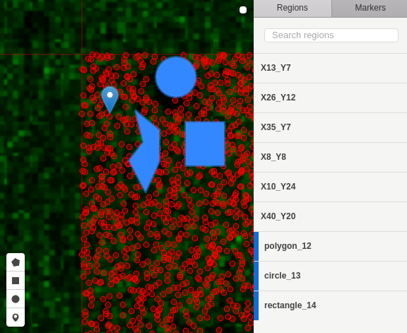

It is also possible to select or deselect the elements and regions as necessary by clicking on their name in the list.

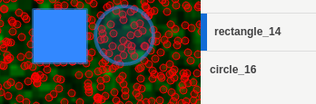

Clicking in the right buttton is possible to search by name, delete, rename or change the colour of the selected item.

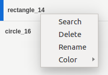

In the side of the layers it is possible too, clicking right button, and appears the same options excepting the color.

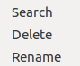
